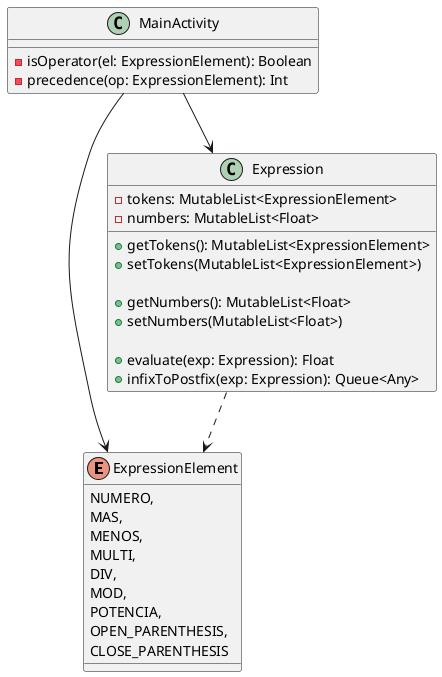

```plantuml
@startuml

enum ExpressionElement {
    NUMERO,
    MAS,
    MENOS,
    MULTI,
    DIV,
    MOD,
    POTENCIA,
    OPEN_PARENTHESIS,
    CLOSE_PARENTHESIS
}

class Expression {
    - tokens: MutableList<ExpressionElement>
    - numbers: MutableList<Float>

    + getTokens(): MutableList<ExpressionElement>
    + setTokens(MutableList<ExpressionElement>) 

    + getNumbers(): MutableList<Float>
    + setNumbers(MutableList<Float>)

    + evaluate(exp: Expression): Float
    + infixToPostfix(exp: Expression): Queue<Any>
}

class MainActivity {
    - isOperator(el: ExpressionElement): Boolean
    - precedence(op: ExpressionElement): Int
}

MainActivity --> Expression
MainActivity --> ExpressionElement
Expression ..> ExpressionElement

@enduml
```
